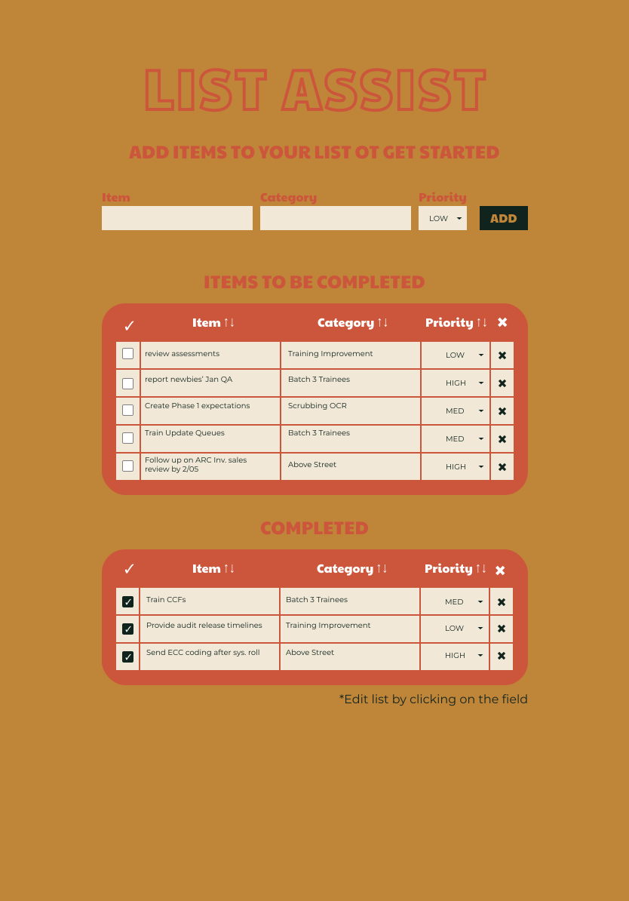

# List Assist
> A versitile tool to organize all tasks, lists, todos for your personal life, work, family organization, and more.
> Check it out [here](https://listassist.netlify.app/). 

## General Information
I wanted to take the classic React project, a to do list, and spice it up with some extra detail and valuable functionality.  With List Assist, you can enter not only the task you need to do, but the category and priority of the task.  Category can be used to classify a specific project if using the tool as a work task manager, a class/extra curricular if trying to keep track of various student activties, or even a child if you are a parent trying to keep track of all the different things you need to do for each kid.  From there you can also set a priority to help you figure out what needs to be done ASAP.  You can also sort each input column so you can visually see your list items in groups.

## Technologies Used
- HTML
- CSS
- JavaScript
- React

## Features
- Inputs for "Item", "Category", and "Priority"
- Sortable columns
- Editable cells
- When list item is marked as complete, it gets bumped to a "Completed" list and can easily be bumped back up.

## Design
Check out the FIGMA file [here](https://www.figma.com/file/6xFlgiiHTNFSHDwoHLEG3u/List-Assist?type=design&node-id=0%3A1&mode=design&t=VgK9RG8ZNQm2trr5-1)

## Challenges and Future Additions

Challenges:
- Getting my script to correctly sort my columns both alphabetically and reverse alphabetically as expected, upon clicking a column head took a bit of trial and error.  I eventually landed on a useEffect that had 2 states as dependencies which allows my functions to execute as expected.

Future Additions:
- To add the ability to set preselected options for category if the user desires
- to add the ability to add/edit/delete the columns and the names for further personalization for the user